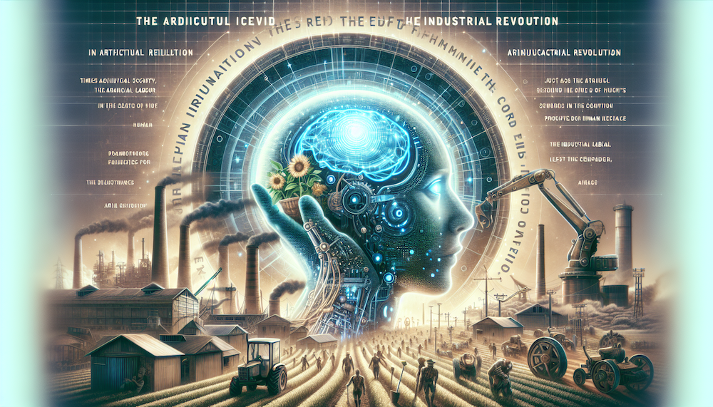

# AI 是工业革命的谢幕，而不是新一次的开始

农业革命有尽头，为什么工业革命就会永恒？人类的宿命就是永久的拧螺丝吗？

在粮食匮乏的时代，农业革命曾是人类活动的核心，面朝黄土背朝天几千年。直到化肥（及耕种机械等）的发明，5%的人口从事农业即能满足所有人的粮食需求，种地不再是人类的关注和活动核心。

而后，在物质匮乏的年代，工业革命是人类活动的核心，生产制造被当时代人当作通往天堂的唯一真理和神药，兴起了拜物教。社会的结构就是一切为了扩大工业生产，人为了生产而活着。

而今，工业革命也已经 300 岁了！现代社会的一切都在指数加速发展，远超石器时代、农业时代的节奏。时至今日，人类的生活工业品需求基本已解决，许多领域甚至出现了大量的生产过剩，生产不再是问题，消费才是。而人工智能加持下的生产制造，正如化肥加持的种地一样，将进一步把大量人口从日夜颠倒拧螺丝的非人性的工作中解放出来，这是迈向新范式的转折点。

最近 20 年来，全世界市值最高、引领最新发展的前列公司，已经不再是工业时代的机械、电气、石油公司，而是“务虚”的信息智能公司。

人类的新范式，必将会跨越农业、工业阶段，问题只是什么时间？也许 AI 就是工业时代的“化肥”，也许还要再等等。但目前看来，极有希望，AI 加持机械能够把人类从没日没夜拧螺丝中解放出来，5%人口从事工业就能满足全世界的需求。正如种地不再是工业时代的核心，工业革命也终将谢幕，甚至不再以“生产”为人类活动的核心。人类将走向下一个未知的领域。

---

[**🔙️ 返回首页**](../../home.md)
