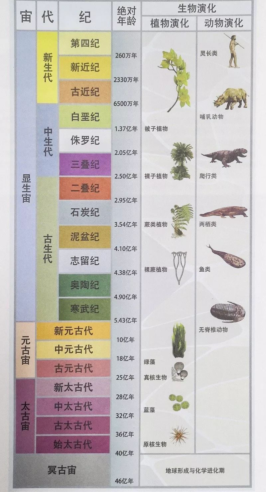
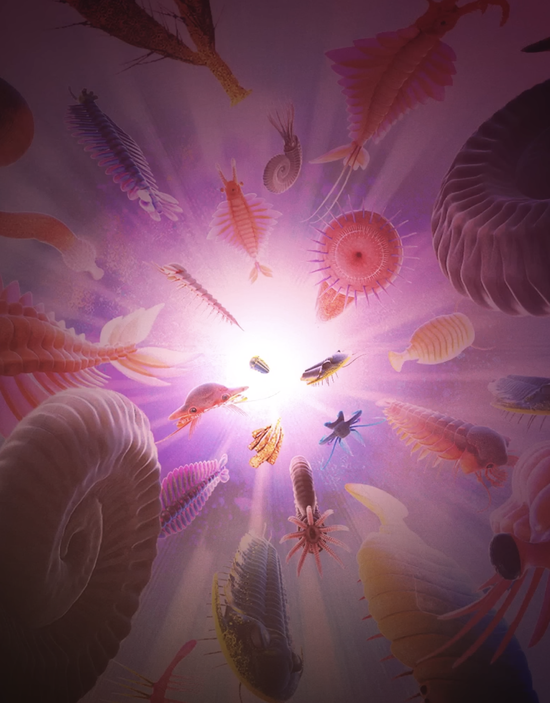
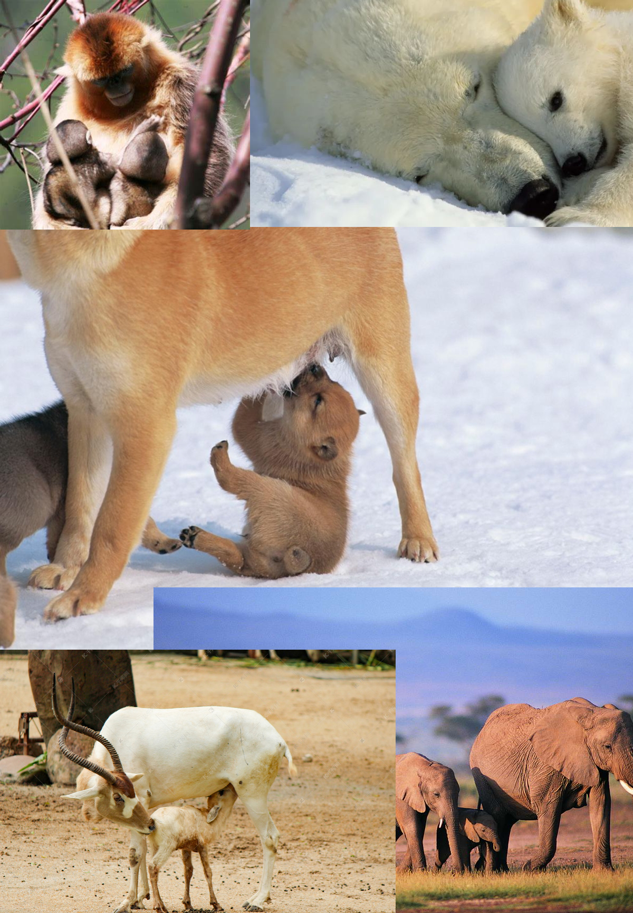
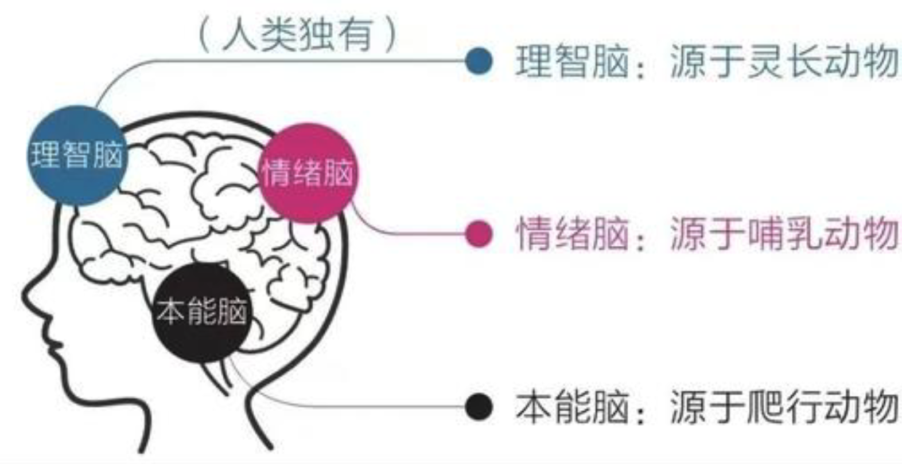
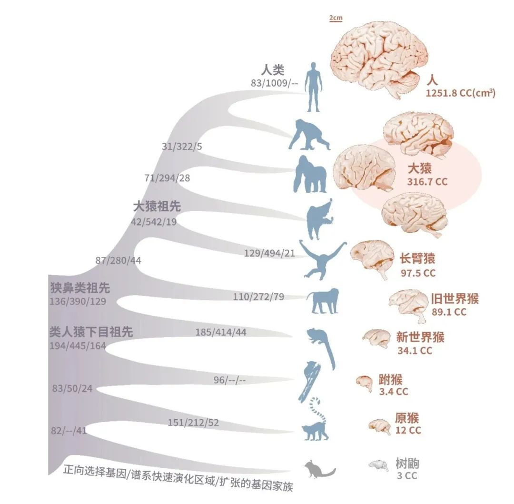

# 究竟什么是智能：光，符号，AGI

---

通用人工智能有戏吗？

超级人工智会把人类远远抛开吗？

让我们忘掉一切，回到最初：所谓智能，到底是什么？

</img>

### 寒武纪，三叶虫，光，眼睛，感知，意识

在 5 亿年前，地球上有光，有万物，有生命，却没有任何生命知道世界的存在，一切都在蒙昧中。

直到某一天，一种生命长出了眼睛，看见了光！

从此，生命发现了世界，拥有了感知和意识。第一种动物“三叶虫"诞生了，地球进入了动物的纪元，古生代寒武纪。

意识，就是感知到外界，而察觉到了自我和世界的分别。

</img>

### 中生代，爬行动物，小脑，本能

再到 2 亿年前的中生代，爬行动物崛起，在激烈竞争中发展了**本能**，编码在小脑脑干（爬行脑、本能脑）里，掌管着呼吸、疼痛、饥饿、性欲等等一切动物生命的基本驱动力。

人类继承了爬行脑，作为生命最深处的指挥官，在婴儿时期占据主导。

### 新生代，哺乳动物，大脑，感情

来到 1 亿年前的新生代，爬行动物的一个分支，逐渐发展成了哺乳动物。

一切感情，都起源于母子哺乳行为，由此发展了喜怒哀乐贪嗔妒等一切情绪，编码在大脑杏仁核（哺乳脑、情绪脑）。

所有哺乳动物都拥有感情，只是或多或少。因此人类也继承、拥有了感情。

</img>

### 新生代第四纪，灵长动物，大脑新皮层，智能

5000 万年前，哺乳动物的一支发展出了灵长目，在更强壮的肌肉、更快速的奔跑等无数可能中，灵长目选择了强化发展大脑新皮层，获得了一项新的特性：智能，表现在对生存环境的理解和主动应对，即环境智能。

500 万年前，灵长目的一支，人科动物开始崛起。人科动物从灵长目脱颖而出，有千百种影响因素，但最关键的，应当是：文字符号。

**人的所谓智能，就是对文字符号的处理能力，即符号智能**。外部世界经由各种器官的感知，进入大脑新皮层的神经网络，经过亿万神经元的处理，得到了一个全新的非自然的符号世界。

- 文字的创造，是地球生命第一次拥有了抽象能力，产生了概念。
- 文字的记录，产生了超越寿命、种群的远期记忆。
- 文字的组合，产生了逻辑、归纳、推理。
- 文字构建的幻想，产生了观念，构造出道德、伦理、法律、主义、哲学、科学......

</img>

没有文字符号，人类的智力就没有依托，没有发展，就会和类人猿一样，停留在简单的语音沟通上。有了文字符号，智人开始能够对万物进行命名，抽象成概念，进行逻辑推理，创造了道德、伦理、法律、主义、哲学、科学......

近万年来，凭借文字而不断强化发展智能，人类从灵长目动物中脱颖而出，生活范式从采摘狩猎，到农业革命，到工业革命，直到今天。越来越多迹象表明，工业革命已经到头了，我们即将走进一场新的范式革命。

### AGI，第二次智能革命，未来已来？

再次回顾地球史：

| 物种     | 纪元                       | 器官                               | 特性                                                                               |
| -------- | -------------------------- | ---------------------------------- | ---------------------------------------------------------------------------------- |
| 三叶虫   | 古生代（5 亿年前）         | 眼睛（脑神经）                     | 感知：色彩，距离，运动 意识：自我和世界                                       |
| 爬行动物 | 中生代（2 亿年前）         | 爬行脑（小脑脑干）                 | 本能：呼吸，心跳，生存，繁衍                                                       |
| 哺乳动物 | 新生代（1 亿年前）         | 哺乳脑（大脑杏仁核，亿级神经元）   | 感情：喜怒哀乐贪嗔妒                                                               |
| 灵长动物 | 新生代-第三纪（5000 万年） | 理智脑（大脑新皮层，十亿级神经元） | 环境智能：理解和应对周边环境                                                       |
| 人科动物 | 新生代-第四纪（500 万年）  | 理智脑（大脑新皮层，百亿级神经元） | 符号智能：抽象，记录，逻辑，幻想，创造 活动范式：采摘狩猎->农耕畜牧->工业生产 |
| 人工智能 | 新生代-第四纪（今天）      | GPU，人工神经网络，千亿级神经元    | 超级智能：第二次智能革命，将诞生新的能力类型 活动范式：？？？                 |
| ？？？   | 下一个新纪元（未来）       | 必然是人类缺乏的，无法想象的器官   | 应当不再是智能，而是一种全新的特性                                                 |

- 5 亿年前，地球上有细胞生物、藻类生物，在无数可能里，其中的一支发展出了眼睛、神经，第一次看见了光，发现了世界，拥有了感知和意识，成为动物。
- 上亿年后，原始动物中的一支，发展了脊椎、脑干，成为爬行动物，强化了本能，自由的生存、繁衍。一切动物都拥有爬行脑，拥有本能。
- 又经过上亿年，在无数可能里，爬行动物中的一支发展出了哺乳器官，成为哺乳动物，拥有丰富的感情。
  - 一切感情都源于哺乳行为，一切哺乳动物都拥有感情。
  - 哺乳动物的神经元数量达到亿级，例如小鼠 1400 万，猕猴 17 亿，大象 56 亿。
- 又经过上亿年，在无数可能里，哺乳动物中的一支强化发展了大脑新皮层，神经元数量达到十亿级，成为灵长目动物，拥有了环境智能。
  - 猩猩的大脑新皮层神经元 80 亿。
- 灵长目动物的大脑新皮层继续增长，形成百亿级神经元的信息传递网络，涌现出了文字符号的处理能力，造就了人类。
  - 智人的大脑新皮层神经元 160 亿。
  - 人类智能的本质，就是文字符号的抽象、记录、构建能力，引发了第一次智能革命。
  - 人类智能推动了几千年来的活动范式：采摘狩猎->农耕畜牧->工业生产->下一代新范式。
- 今天，又经过许多可能的方向探索，终于在 2022 年底，人工神经网络 + 文字生成 这一支道路，突然涌现出了 AI 对文字符号的处理能力。
  - 从复现人类智能的 AI（2022），到达到人类水平的通用智能 AGI（2027），再到超级智能 ASI（2030）
  - 借助文字符号引发了第一次智能革命，现在借助几乎无限的内存和加速计算，正在引发第二次智能革命，是工业革命的终结，将人类活动的新范式？
- 更远的未来，又会是什么智能之外的、人类所完全无法想象的东西，进入新的地球纪元呢？

此时此刻，恰如彼时彼刻，只不过，人脑有限的记忆、算力，即将被无限的内存、GPU 所代替。

### 从大语言模型里涌现的，是不是智能？为什么来自大语言模型？

先来看看，是什么微小的选择，让人类从灵长目动物里脱颖而出？

- 提高神经元规模：灵长目动物在更强壮的肌肉、360 度的眼睛等等无数发展方向里，选择了发育大脑新皮层，增加神经元到十亿级。人类进一步提升神经元到百亿级，智人拥有 160 亿神经元。
- 专注于文字处理：人类在智能的无数发展方式里，偏偏选择了文字符号。随着文字处理能力的积累，涌现出了抽象、记录、逻辑、创造等等独属于人类的特性。文字符号，引发了第一次智能革命。

而大语言模型，恰好对应着人类的这两大秘诀：

- 大：在几乎所有人不以为然的时候，OpenAI 坚定的不断提高神经网络规模，达到千亿级参数（GPT2: 15 亿，GPT3: 1750 亿，GPT4: 1.8 万亿）。
  - 这在物理上，复现了爬行动物-哺乳动物-灵长动物-人类的大脑神经元指数式增长。
- 语言：在 GPT 之前，人工智能有各种开发方向。只有 Ilya Sutskever 坚定的认为文字生成就是智能，在单词预测这个简单任务里，蕴含着人类的所有智能。
  - 这在哲理上，复现了人类从灵长动物中脱颖而出，从环境智能发展出符号智能的路线。

水到渠成！大语言模型，正是在人类从爬行动物-哺乳动物-灵长动物中脱颖而出的成功路线上，复现并继续加码而已。

大语言模型涌现的，毫无疑问就是人类所引以为傲的智能。大语言模型涌现了智能，完全是自然而然的，并且将继续涌现人类的生物大脑器官无法支持、无法想象的新的能力。

</img>

### 超级智能就是新纪元的主宰吗？

地球史上每一代的突破，都从无数可能性中，发展了一种全新的特性。

智能不会是唯一的道路，而是无数可能性中充满偶然的选择。这也不是最后的终点，而只是当前的一站。

即使超级智能远远超越了人类，这也不是人类之后的新纪元，因为每一代都应当拥有全新的器官和特性。既然人类依靠智能而崛起，下一个纪元的特性，就不该是智能了。

只因人类依靠智能而超越了哺乳动物，所以人类以为超过自己的会是更高的智能。其实，即使超级智能，也只是智能这条路线的继续发展。最终真正超越人类的，肯定是智能以外的，人类因缺乏器官而完全无法想象的某种特性。

真正的新纪元，是我们人类完全无法想象的。

---

[**🔙️ Go Home**](../../_enus.md)
